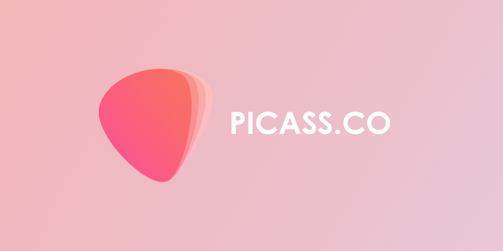

# Picass.co Website

Picass.co Website's public repository

## Information

The main purpose of this repository is to develop it faster and provide a better user experience. If you want to help us by contributing, you could read [Contributing text](./CONTRIBUTING)

## License

Picass.co Website is MIT licensed.

_Made with [Next.js](https://nextjs.org) and 💖 by
_